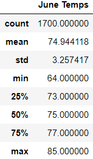

# surfs_up

## Overview of the analysis:
Analyze the temperature on Oahu and provide statistics for the months of June and December in order to determine if this is a good location to sell surfboards and ice cream.

## Results:

### June

Based on the analysis of 1700 days for the month of June from 2010 to 2017:
- The average temperature was 74.9°F
- The lowest temperature was 64°F
- The highest temperature was 85°F

### December

Based on the analysis of 1517 days for the month of December from 2010 to 2016:
- The average temperature was 71°F
- The lowest temperature was 56°F
- The highest temperature was 83°F

## Summary:
The temperatures are slightly higher in June, however, the temperatures in December are still suitable for surfing and eating ice cream.

This data set does not include temperatures for December 2017. Although it might not differ a lot from the previous years, it would be better if we could have the same year range to analyze both months.

In order to provide more insights whether Oahu is the perfect location for the Shake 'n Surf shop, a more thorough analysis could be made by getting the total precipitation for the months of June and December and the precipitation at the most active station for the months of June and December.

### Total precipitation for the months of June and December:

def monthly_precip(month):
    return session.query(Measurement.date, Measurement.prcp).filter(extract('month', Measurement.date) == month).all()

june_precip_results = monthly_precip(6)
dec_precip_results = monthly_precip(12)

### Precipitation at the most active station (USC00519281) for the months of June and December:

def station_precip(month):
    return session.query(Measurement.prcp).filter(Measurement.station == 'USC00519281').filter(extract('month', Measurement.date) == month).all()

june_station_precip_results = station_precip(6)
dec_station_precip_results = station_precip(12)
